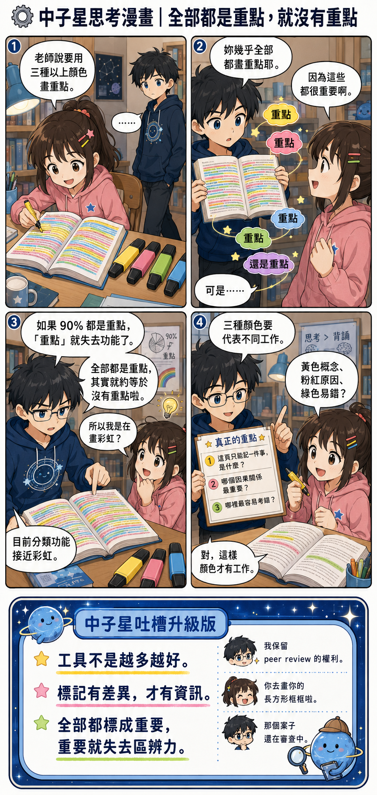

# ⚙️ Neutron-Star-Thinking-Lab

## 中子星思考實驗室

### Rules × People × Models × Flexibility

> **不是把稜角磨掉，而是讓思考多一個自由度。**
>
> **保留自己的模型，也學會看懂別人的模型。**

---

# 🌌 這是一個研究「人類為什麼這樣運作」的實驗室

中子星很愛問：

> 「為什麼？」

有些規則合理。  
有些規則……嗯，值得 peer review。

這裡不教盲從，也不鼓勵逢規則必戰。

我們練的是：

> **看懂目的 → 比較方法 → 算算成本 → 決定要不要出手。**

---

# 01｜Rules & Systems｜規則與制度

## 01｜全部都是重點，就沒有重點

老師規定：

> 重點要用三種以上顏色螢光筆。

結果妹妹整頁都亮晶晶。

哥哥看了幾秒：

> 「妳幾乎全部都畫重點。」
>
> 「那其實就約等於沒有重點啦。」

### ⚙️ 中子星版本

> **標記要有差異，才有資訊。**
>
> 全部都重要，
>
> **就沒東西特別重要。**

---

## 02｜這條規則很蠢，我還要遵守嗎？

自然老師規定：

- 紅、藍、黑三種原子筆
- 只能畫長方形框
- 長方形還有筆畫規格
- 小組長負責驗收

哥哥的大腦：

> 「……這是在學自然，還是在考框框證照？」

後來決定：

> **可以覺得規則很怪。**
>
> **但如果 30 秒能完成，就不必發動制度革命。**

### ⚙️ 中子星版本

先問：

1. 有沒有傷害？
2. 成本高不高？
3. 不做會怎樣？
4. 值得為它開戰嗎？

> **格式通過，腦力保留。**

---

## 03｜穿班服真的會增加向心力嗎？

妹妹說：

> 「老師規定一週穿兩天班服，增加班級向心力。」

哥哥：

> 「穿了之後真的比較有向心力嗎？」
>
> 「如果只是不要穿便服，不能穿運動服嗎？」

中子星開始跑模型：

> 班服 → ？？？ → 向心力增加

妹妹：

> 「哥哥，我只是要穿衣服。」

### ⚙️ 中子星版本

看到規則先問：

> **它想解決什麼問題？**

再問：

> **這個方法真的有效嗎？**

最後再問：

> **值得為它開戰嗎？**

結論：

> 「穿就穿。」
>
> **「但我保留 peer review 的權利。」**

---

# 🧠 之後這裡還會研究什麼？

### People & Friction
人際摩擦。  
別人到底在想什麼？我又卡在哪裡？

### Social Energy
省能社交。  
不是每件事都值得解釋到宇宙盡頭。

### Model Debugging
模型偵錯。  
吐槽別人之前，順便檢查自己有沒有漏變數。

### Boundaries & Responsibility
界線、權限與責任。  
這件事是我的事嗎？我現在需要介入嗎？

---

# ⭐ 中子星原則

> **可以懷疑。**
>
> **可以吐槽。**
>
> **可以不同意。**
>
> **也可以修正自己的模型。**

不是每一場爭論都要贏。  
不是每一條怪規則都要革命。

真正的思考彈性是：

> **有自己的立場，**
>
> **也有不只一種行動方式。**

---

### Observe → Model → Compare → Choose → Debug

> **不是把稜角磨掉，而是讓思考多一個自由度。**

