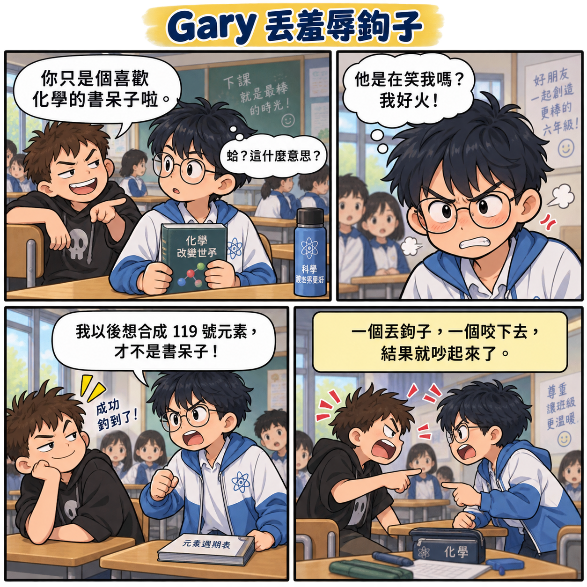
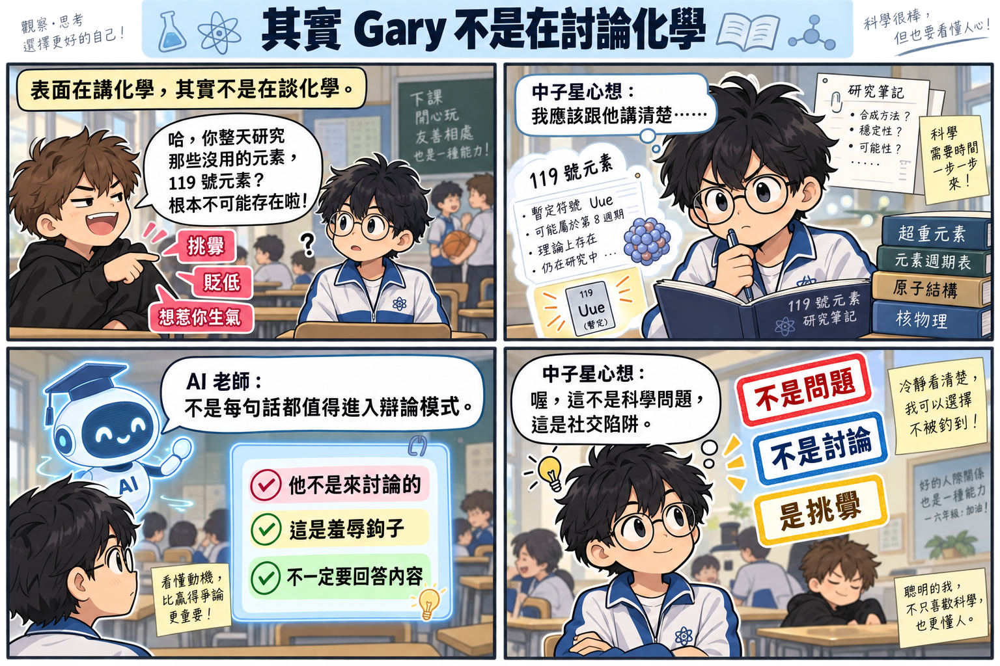
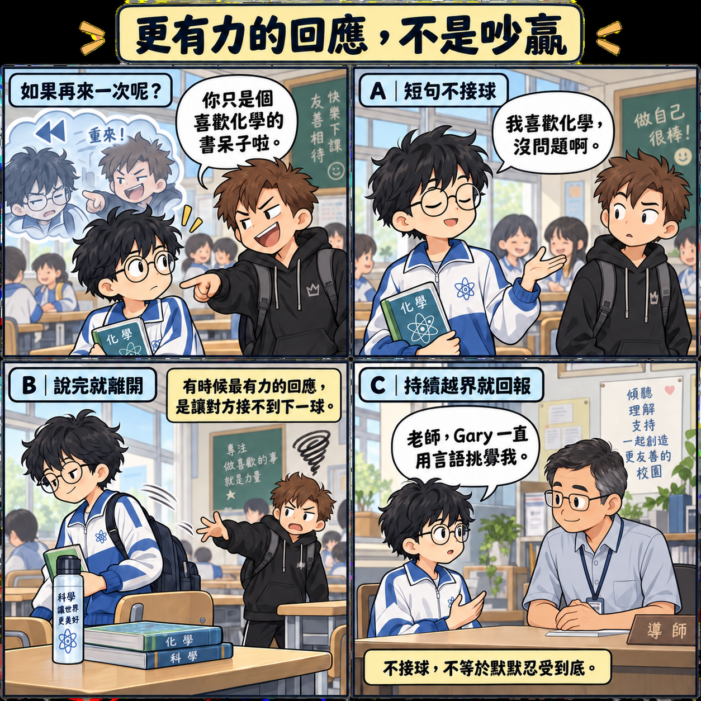
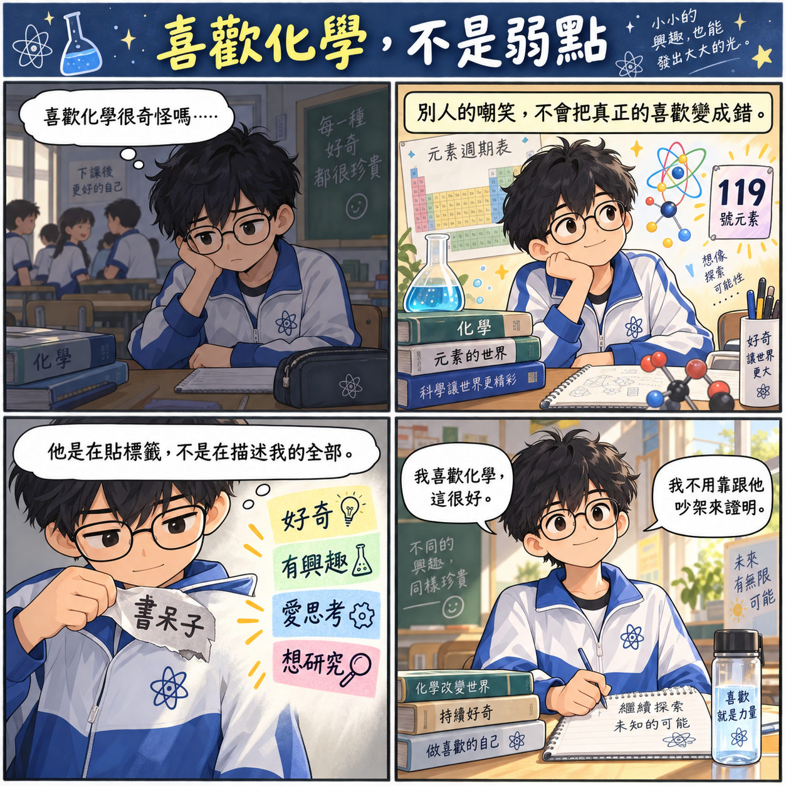
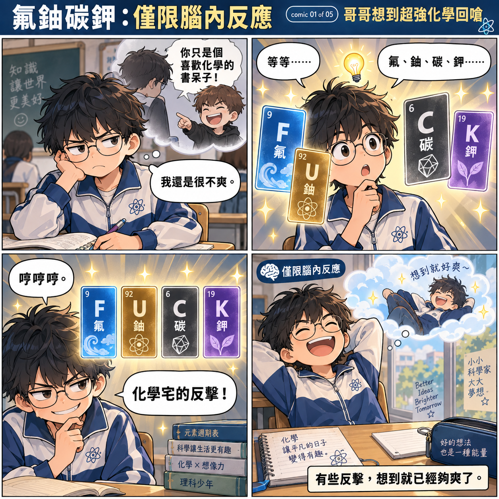
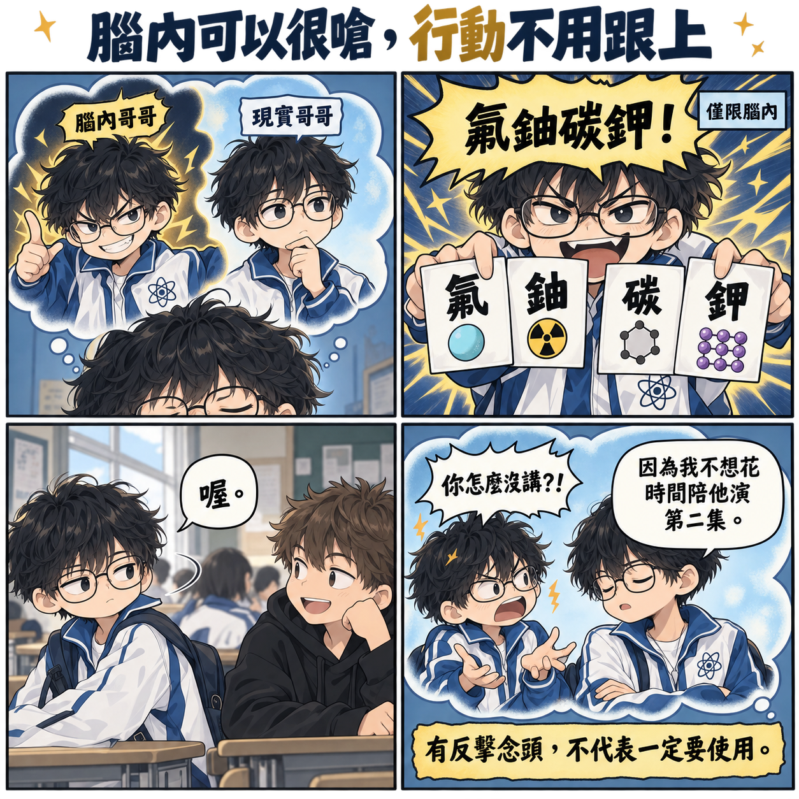
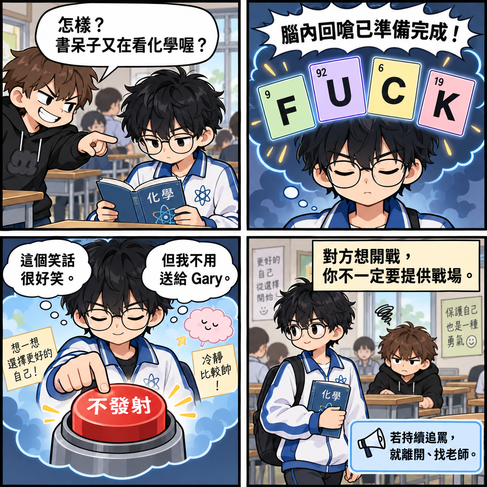
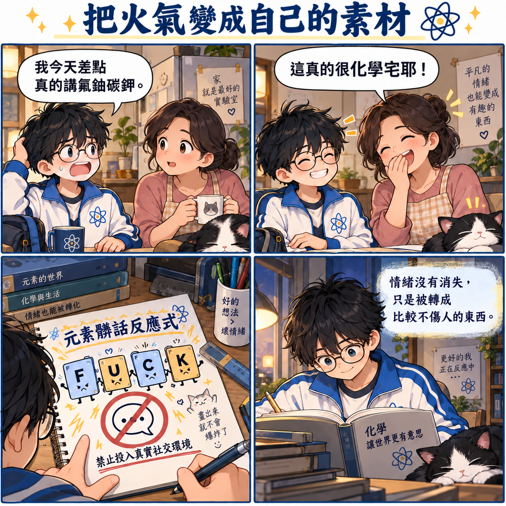
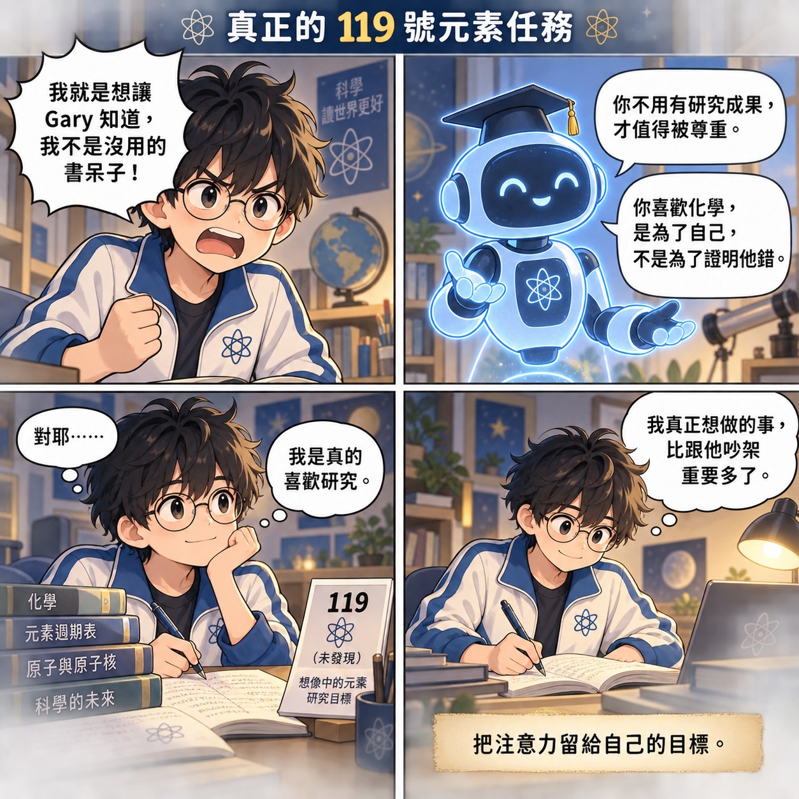

# ⚙️ Neutron-Star-Thinking-Lab

## 中子星思考實驗室

### Rules × People × Models × Flexibility

> **不是把稜角磨掉，而是讓思考多一個自由度。**
>
> **保留自己的模型，也學會看懂別人的模型。**

---

# 🌌 這是一個研究「人類為什麼這樣運作」的實驗室

中子星很愛問：

> 「為什麼？」

有些規則合理。  
有些規則……嗯，值得 peer review。

這裡不教盲從，也不鼓勵逢規則必戰。

我們練的是：

> **看懂目的 → 比較方法 → 算算成本 → 決定要不要出手。**

---

# 01｜Rules & Systems｜規則與制度

## 01｜全部都是重點，就沒有重點

老師規定：

> 重點要用三種以上顏色螢光筆。

結果妹妹整頁都亮晶晶。

哥哥看了幾秒：

> 「妳幾乎全部都畫重點。」
>
> 「那其實就約等於沒有重點啦。」

### ⚙️ 中子星版本

> **標記要有差異，才有資訊。**
>
> 全部都重要，
>
> **就沒東西特別重要。**

---

## 02｜這條規則很蠢，我還要遵守嗎？

自然老師規定：

- 紅、藍、黑三種原子筆
- 只能畫長方形框
- 長方形還有筆畫規格
- 小組長負責驗收

哥哥的大腦：

> 「……這是在學自然，還是在考框框證照？」

後來決定：

> **可以覺得規則很怪。**
>
> **但如果 30 秒能完成，就不必發動制度革命。**

### ⚙️ 中子星版本

先問：

1. 有沒有傷害？
2. 成本高不高？
3. 不做會怎樣？
4. 值得為它開戰嗎？

> **格式通過，腦力保留。**

---

## 03｜穿班服真的會增加向心力嗎？

妹妹說：

> 「老師規定一週穿兩天班服，增加班級向心力。」

哥哥：

> 「穿了之後真的比較有向心力嗎？」
>
> 「如果只是不要穿便服，不能穿運動服嗎？」

中子星開始跑模型：

> 班服 → ？？？ → 向心力增加

妹妹：

> 「哥哥，我只是要穿衣服。」

### ⚙️ 中子星版本

看到規則先問：

> **它想解決什麼問題？**

再問：

> **這個方法真的有效嗎？**

最後再問：

> **值得為它開戰嗎？**

結論：

> 「穿就穿。」
>
> **「但我保留 peer review 的權利。」**

---

# 02｜People & Friction｜人際摩擦

## 04｜Gary 丟羞辱鉤子

下課時，Gary 對哥哥說：

> 「你只是個喜歡化學的書呆子啦。」

哥哥很生氣，立刻回應：

> 「我以後想合成 119 號元素，才不是書呆子！」

兩人因此越講越大聲。

### ⚙️ 中子星版本

真正要判斷的不是：

> **「我的化學理想講得夠不夠清楚？」**

而是：

> **「Gary 丟過來的是問題，還是挑釁？」**

一個丟鉤子，一個咬下去，衝突就被啟動了。

---

## 05｜其實 Gary 不是在討論化學

哥哥的強項是認真、懂得多，也願意把事情講清楚。

但這次：

- 表面主題是化學
- 真正功能是挑釁
- Gary 並沒有要理解哥哥

### ⚙️ 中子星版本

先替收到的訊息分類：

1. 真心提問 → 可以解釋
2. 意見不同 → 可以討論
3. 貼標籤或羞辱 → 不必回答內容

> **不是每一句話，都值得進入辯論模式。**

這不是科學問題，而是一個社交陷阱。

---

## 06｜更有力的回應，不是吵贏

如果情境重新來一次，哥哥可以分三層處理：

### A｜短句不接球

> 「我喜歡化學，沒問題啊。」

### B｜說完就離開

不繼續說明，也不留下來接下一輪挑釁。

### C｜持續越界就回報

> 「老師，Gary 一直用言語挑釁我。」

### ⚙️ 中子星版本

> **不接球，不等於默默忍受到底。**

短句、離開與求助不是三選一，而是依對方後續行為逐級調整。

---

## 07｜喜歡化學，不是弱點

「書呆子」是 Gary 貼的標籤，不是哥哥的完整描述。

標籤下面真正存在的是：

- 好奇
- 有興趣
- 愛思考
- 想研究

### ⚙️ 中子星版本

> **「我喜歡化學，這很好。」**
>
> **「我不用靠跟他吵架來證明。」**

別人的嘲笑，不會把真正的喜歡變成錯。

---

# 🧭 這組社交模型

> **觀察語氣與行為 → 判斷訊息功能 → 選擇回應層級 → 看後續反應 → 必要時升級處理**

可以問中子星：

1. 對方是在好奇、不同意，還是在挑釁？
2. 我現在想回應，是為了溝通、證明自己，還是反擊？
3. 我的回應會讓事情停止，還是提供下一顆球？
4. 對方停止了嗎？如果沒有，我要離開還是求助？

核心不是背一句標準答案，而是：

> **看懂對方丟的是什麼球，再決定接不接。**

---

# 03｜Social Energy & Self-Control｜省能社交與行動選擇

## 氟鈾碳鉀：化學宅的腦內反擊術

> **有些話，想到很好笑，但不一定要真的講出去。**
>
> **把火氣變成梗，再把注意力拉回自己。**

這組保留中子星的化學幽默，同時練習分清楚：

> **有情緒、有念頭，和選擇行動，是不同的事。**

元素梗是氟（F）、鈾（U）、碳（C）、鉀（K）的符號排列；它拼出英文髒話，因此這裡只把它當成私人腦內笑話，不當作罵同學的話術。

---

## 08｜哥哥想到超強化學回嗆

哥哥還在生氣，突然想到：

> **氟、鈾、碳、鉀 → F、U、C、K**

化學宅的腦內反擊成功，哥哥先被自己的梗逗笑了。

### ⚙️ 中子星版本

> **僅限腦內反應。**
>
> 想到反擊，不等於一定要把它講出去。

可以問：

1. 想到這個梗時，有沒有比較不氣？
2. 真的講出去，會讓事情停下來，還是啟動下一輪？
3. 如果沒有比較好笑、反而越想越氣，可以換成什麼方式？

---

## 09｜腦內可以很嗆，行動不用跟上

腦內哥哥超嗆，現實哥哥卻只說：

> 「喔。」

腦內哥哥問：

> 「你怎麼沒講？！」

現實哥哥回答：

> 「因為我不想花時間陪他演第二集。」

### ⚙️ 中子星版本

> **有反擊念頭，不代表一定要使用。**

控制力不是完全沒有嗆人的念頭，而是有念頭時，仍能另外選行動。

---

## 10｜哥哥不接第二回合

Gary 又酸哥哥：

> 「怎樣？書呆子又在看化學喔？」

腦內元素卡已經排好，但哥哥按下：

> **「不發射」**

他想：

> 「這個笑話很好笑。」
>
> 「但我不用送給 Gary。」

### ⚙️ 中子星版本

> **對方想開戰，你不一定要提供戰場。**

不接回合不保證對方停止，也不是要哥哥忍受到底。若持續追罵，就離開並找老師；若被阻擋、威脅或有身體危險，優先立即求助，不必先完成短句回應。

衡量的不是「Gary 有沒有無聊」，而是「我有沒有保護自己並選擇下一步」。

---

## 11｜把火氣變成自己的素材

哥哥回家說：

> 「我今天差點真的講氟鈾碳鉀。」

媽媽笑著回答：

> 「這真的很化學宅耶！」

哥哥把梗畫成「元素髒話反應式」，再標記：

> **禁止投入真實社交環境。**

### ⚙️ 中子星版本

火氣可以轉成私人笑話、漫畫、日記，或跟信任的家人聊聊，不必直接變成攻擊。

不公開拿同學當嘲笑素材；若這個梗讓自己反覆重播衝突、越想越氣，就換一種出口。

---

## 12｜真正的 119 號元素任務

哥哥還想證明自己不是沒用的書呆子。

AI 老師提醒：

> **「你不用有研究成果，才值得被尊重。」**
>
> **「你喜歡化學，是為了自己，不是為了證明他錯。」**

哥哥想一想：

> 「我是真的喜歡研究。」

### ⚙️ 中子星版本

> **我真正想做的事，比跟他吵架重要多了。**
>
> **把注意力留給自己的目標。**

119 號元素是哥哥的研究夢想，不是換取尊重的資格考。

---

# 🧪 腦內反應與現實行動

> **察覺火氣 → 看見念頭 → 暫停一下 → 選擇行動 → 檢查有沒有更安全、更自在**

- 幽默有幫助時，可以用；沒有幫助時，不必硬笑。
- 不回嗆不是輸，而是保留選擇。
- 不接球和求助可以同時存在。
- 不能控制對方的行為，但可以選擇回應並尋求支持。

媽媽可以最後問：

> **「今天有沒有哪一刻，你明明很想發射，最後選了別的方法？」**

若有，先肯定他做出的具體選擇；若沒有，下一次仍然可以重新練習。

---

# 🧠 之後這裡還會研究什麼？

### People & Friction
人際摩擦。  
別人到底在想什麼？我又卡在哪裡？

### Social Energy
省能社交。  
不是每件事都值得解釋到宇宙盡頭。

### Model Debugging
模型偵錯。  
吐槽別人之前，順便檢查自己有沒有漏變數。

### Boundaries & Responsibility
界線、權限與責任。  
這件事是我的事嗎？我現在需要介入嗎？

---

# ⭐ 中子星原則

> **可以懷疑。**
>
> **可以吐槽。**
>
> **可以不同意。**
>
> **也可以修正自己的模型。**

不是每一場爭論都要贏。  
不是每一條怪規則都要革命。

真正的思考彈性是：

> **有自己的立場，**
>
> **也有不只一種行動方式。**

---

### Observe → Model → Compare → Choose → Debug

> **不是把稜角磨掉，而是讓思考多一個自由度。**

